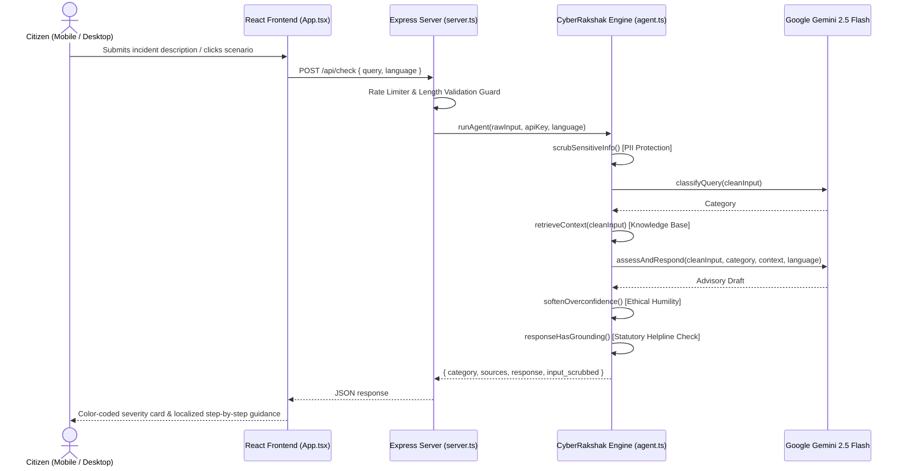

# CyberRakshak — System Architecture

## System Architecture Overview

```mermaid
flowchart TD
    A([👤 User Input\n"Describe what happened"])

    A --> B["🔒 Privacy Guard (src/server/privacy.ts)\nscrubSensitiveInfo()\nRedacts OTP · Aadhaar · Phone · Card · UPI · Passwords"]

    B --> C["⬛ STEP 1: CLASSIFY (src/server/classifier.ts)\nclassifyQuery()\nGemini 2.5 Flash Prompt → Scam Category\n─────────────────────────────\nRobust Fallback: Regex & Word-Boundary Keywords"]

    C --> D["⬛ STEP 2: RETRIEVE (src/server/retriever.ts)\nretrieveContext()\nTF-IDF & BM25 Knowledge Base Search\nReturns Top Ranked Advisory Chunks + Citations"]

    D --> E["⬛ STEPS 3+4: ASSESS & RESPOND (src/server/responder.ts)\nassessAndRespond()\nGemini 2.5 Flash Grounded Generation:\n  • Risk Severity & Verification\n  • Reasoning & Immediate Red Flags\n  • Action Steps (Helpline 1930 / cybercrime.gov.in)"]

    E --> F["⬡ ETHICS & HUMILITY FILTER (src/server/ethics.ts)\nsoftenOverconfidence()\nReplaces absolute dogmatic phrases\nwith probabilistic, responsible citizen guidance"]

    F --> G{"responseHasGrounding()\nContains 1930 & cybercrime.gov.in?"}

    G -- "Yes ✓" --> H["📤 Final Response\nDelivered via Secure Express REST API\n(Session history stores scrubbed input only)"]
    G -- "No — append fallback" --> H

    style A fill:#e8f4fd,stroke:#3b82d4
    style B fill:#fef3c7,stroke:#f59e0b
    style C fill:#f0fdf4,stroke:#22c55e
    style D fill:#f0fdf4,stroke:#22c55e
    style E fill:#f0fdf4,stroke:#22c55e
    style F fill:#fdf2f8,stroke:#a855f7
    style G fill:#fdf2f8,stroke:#a855f7
    style H fill:#e8f4fd,stroke:#3b82d4
```

---

## Component Details

| Module | Location | Primary Responsibilities |
|---|---|---|
| **API Gateway & Security** | `server.ts` | Rate limiter, security headers, input validation, static SPA serving |
| **Privacy Guard** | `src/server/privacy.ts` | Multi-pattern PII scrubbing (Aadhaar, cards, OTPs, UPI, Indian phones) |
| **Intent Classifier** | `src/server/classifier.ts` | Multilingual intent detection & zero-shot categorization with Gemini |
| **Knowledge Retriever** | `src/server/retriever.ts` | TF-IDF token scoring over CERT-In / MHA advisory corpus |
| **Grounded Responder** | `src/server/responder.ts` | Multilingual citizen advisory generation with Gemini 2.5 Flash |
| **Ethics & Safety Guard** | `src/server/ethics.ts` | Epistemic humility adjustments, statutory fallback injection |
| **Link & APK Inspector** | `src/server/linkInspector.ts` | Domain spoofing detection, APK signature inspection & protocol guard |
| **Client UI & State** | `src/App.tsx` | React 18, Tailwind CSS, dark mode, responsive layout |
| **Quick Action Modals** | `src/components/*` | Emergency Wizard (1930/FIR), Link Inspector, Live Alerts, RBI Rules |

---

## Responsible AI Sequence


